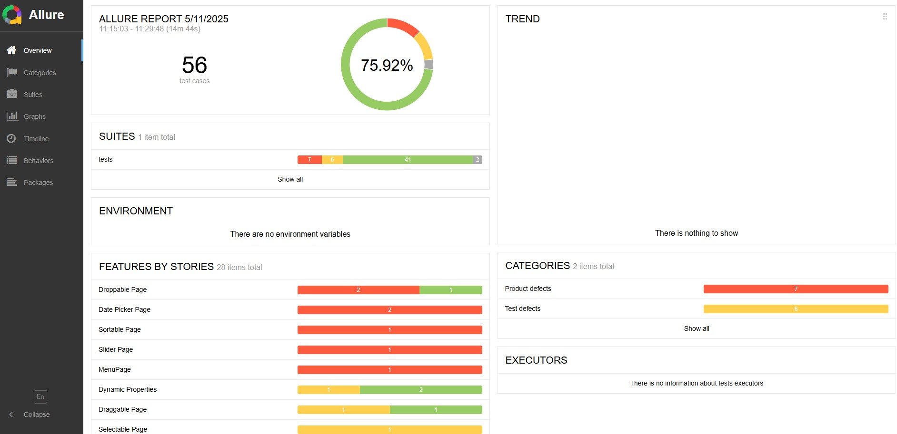
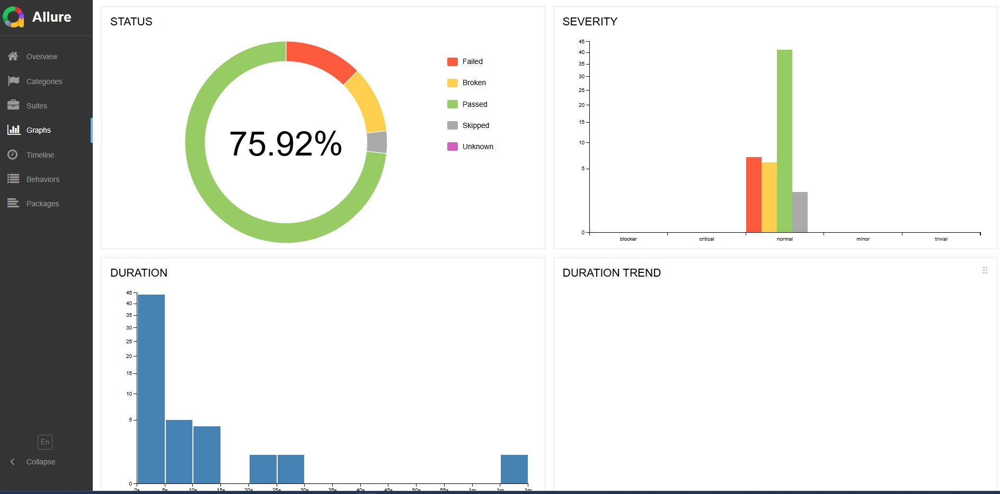
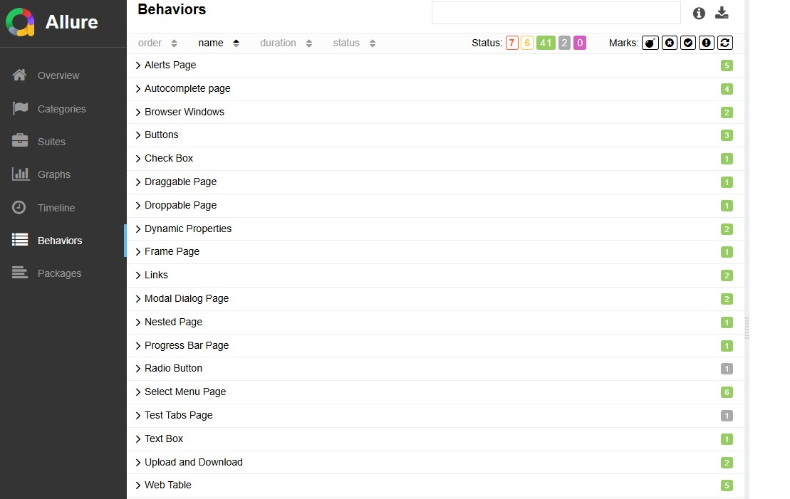

# Проект по автоматизации тестирования


## 📌Описание Проекта

Этот проект представляет собой шаблон фреймворка для автоматизации тестирования пользовательского интерфейса (UI)
веб-приложений, разработанный на языке Python с использованием библиотеки Selenium и фреймворка Pytest. Проект следует
паттерну Page Object Model (POM) для улучшения структурированности, читаемости и поддерживаемости тестов.

Основная цель проекта — продемонстрировать навыки и опыт в области автоматизации UI тестирования, включая:

* Применение паттерна Page Object Model.
* Разработка надежных и поддерживаемых тестовых сценариев.
* Интеграция с системой генерации отчетов Allure Framework.
* Настройка процесса непрерывной интеграции (CI) с использованием GitHub Actions для автоматического запуска тестов и
  публикации отчетов.

Проект разработан как **pet-проект для портфолио** и может быть использован как основа для других проектов по
автоматизации UI тестирования.

## 🎯Тестируемое Приложение и Покрытие

Проект содержит набор автоматизированных тестов для демонстрационного сайта <a href="https://demoqa.com">demoqa</a>. Тесты покрывают взаимодействие со следующими базовыми UI элементами:

* Forms
* Selects
* Widgets
* Alerts
* Interactions
* Checkboxes
* Drag and Drop

## ⚙️Используемые Технологии и Библиотеки

В проекте применяются следующие основные инструменты и библиотеки:

* **Python:** Язык программирования.
* **Pytest:** Фреймворк для написания и запуска тестов.
* **Selenium:** Библиотека для автоматизации взаимодействия с веб-браузерами.
* **Requests:** Библиотека для выполнения HTTP-запросов (может использоваться для вспомогательных задач или работы с
  API, если потребуется расширение фреймворка).
* **Allure Framework:** Инструмент для создания наглядных и информативных отчетов о результатах тестирования.

## 🗂️Структура Проекта

Проект организован в соответствии с принципами Page Object Model. Основная структура каталогов:

```bash
WebAutotestsPOM/
├── .github/                # Настройки GitHub (workflows для CI/CD)
│   └── workflows/
├── data/                   # Файлы с тестовыми данными
├── extensions/             # Дополнительные расширения, (профиль браузера)
├── generator/              # Утилиты для генерации тестовых данных
├── locators/               # Файлы с локаторами элементов страниц
├── pages/                  # Классы Page Object Model, описывающие страницы и их элементы
├── tests/                  # Файлы с тестовыми сценариями
├── .gitignore              # Файл для игнорирования ненужных файлов в Git
├── CONTRIBUTING.md         # Полезные команды для работы с проектом
├── conftest.py             # Файл фикстур Pytest
├── pytest.ini              # Конфигурационный файл Pytest
├── requirements.txt        # Список зависимостей проекта
└── README.md               # Описание проекта
```

## 🛠️Установка и Запуск

Для локальной установки и запуска проекта выполните следующие шаги:

1. **Клонируйте репозиторий:**
   ```bash
   git clone https://github.com/DmitriyFrolov2/WebAutotestsPOM.git
   ```
2. **Установите зависимости Python:**
   ```bash
   pip install -r requirements.txt
   ```
   Убедитесь, что у вас установлен `pip` и Python.
3. **Установите Allure Command-line:**
   Для локального просмотра отчетов Allure необходимо установить Allure Report. Инструкции по установке для различных
   операционных систем можно найти в официальной документации <a href="https://allurereport.org/docs/install/">Install
   or upgrade Allure Report</a>.

## 🚀Запуск Тестов и Генерация Отчетов

Для запуска тестов и генерации отчета Allure выполните следующие команды в терминале из корневой папки проекта:

* **Запуск всех тестов и генерация отчета:**
    ```bash
    pytest tests/ --alluredir=./allure_results ; allure serve ./allure_results
    ```
  Эта команда запустит все тесты в папке `tests/`, сгенерирует файлы отчета в папке `allure_results` и затем
  автоматически откроет отчет в вашем браузере.
* **Запуск одного тестового файла и генерация отчета:**
    ```bash
    pytest tests/form_test.py --alluredir=./allure_results ; allure serve ./allure_results
    ```
  Замените `tests/form_test.py` на путь к нужному вам тестовому файлу.

## 📊 Отчет о Результатах Тестирования (Allure Report)

В проекте настроена генерация наглядных отчетов о прогоне тестов с использованием Allure Framework. Отчет содержит
подробную информацию о каждом тесте и шагах выполнения.

### Автоматическая публикация отчетов:

Благодаря настройке GitHub Actions, каждый прогон тестов в CI автоматически публикует Allure отчет на GitHub Pages Отчет
доступен по ссылке:

🔗 [https://dmitriyfrolov2.github.io/WebAutotestsPOM/](https://dmitriyfrolov2.github.io/WebAutotestsPOM/)

### Главная страница Allure-отчета

<p align="center">

</p>

<details>
<summary> 👈 Страница <code>Graphs</code> </summary>

На странице <code>Graphs</code> можно получить информацию о тестовом прогоне в графическом виде: статус прогона,
распределение тестов по критичности, длительности прохождения, перезапускам, категориям дефектов и так далее.
</details>

### :dart: Информация о тестовом прогоне в графическом виде

<p align="center">

</p>

<details>
<summary> 👈 Страница <code>Behaviors</code> </summary>

На странице <code>Behaviors</code> тесты сгруппированы по проверяемому функционалу _(Epic, Feature, Story)_.
</details>

### 🎯Группировка тестов по проверяемому функционалу

<p align="center">

</p>

<details>
<summary> 👈 Прочие страницы </summary>

* Страница <code>Categories</code> – данная страница предоставляет информацию о распределении дефектов по их видам.
* Страница <code>Suites</code> – на данной странице представляется стандартное распределение выполнявшихся тестов по
  тестовым наборам или классам, в которых находятся тестовые методы.
* Страница <code>Timeline</code> – данная страница визуализирует временные рамки прохождения каждого теста.
* Страница <code>Packages</code> – на этой странице тесты сгруппированы по пакетам, в которых лежат тестовые классы.

</details>

